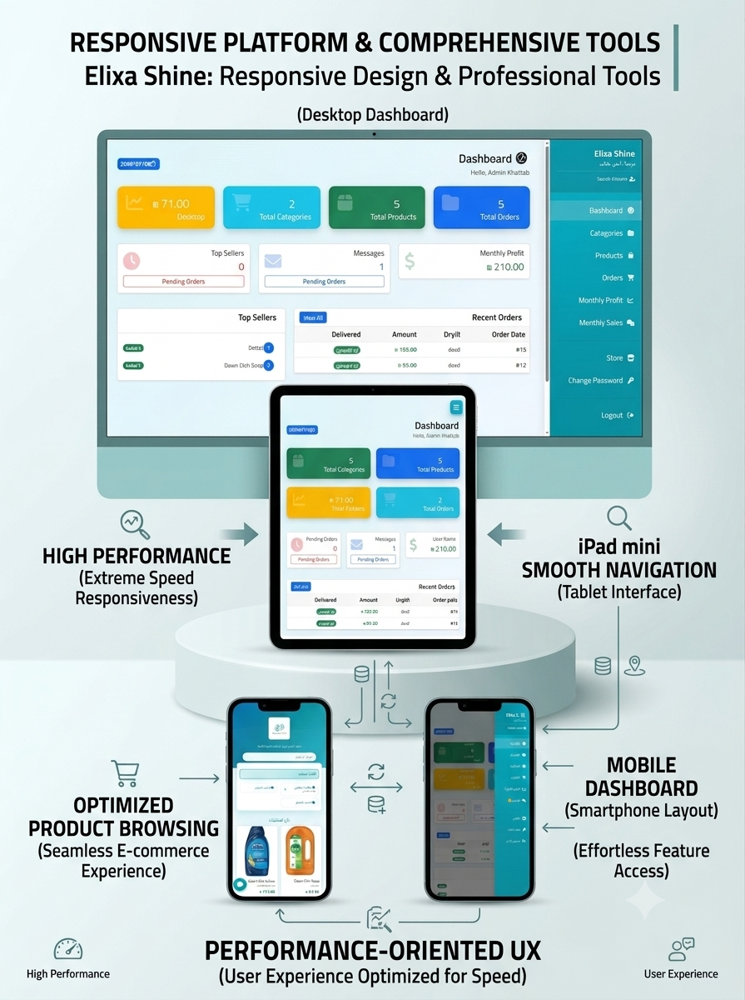

# Elixa Shine

A fully responsive, dynamic E-Commerce platform built with PHP and MySQL, engineered for fast customer checkout and robust administration.

---

## 🎮 Overview

**Elixa Shine** is a modern, full-stack web application designed to deliver an intuitive online shopping experience. It features an adaptive user interface optimized for diverse viewport sizes (from mobile devices and mini iPads to desktop displays) alongside an analytical control center for store administrators to monitor inventory, financial metrics, and sales velocity.

---

## ✨ Features

### Customer Experience
* **Adaptive Responsive Design:** Seamlessly adjusts across all device screens (Mobile, Mini iPad, MacBook Pro, and Large Displays).
* **Streamlined Checkout Flow:** Optimized purchasing process to ensure fast, friction-free customer transactions.
* **Product Catalog:** Interactive product discovery with structured categorizations and detail views.

### Administrative Control Center
* **Analytical Dashboard:** Real-time summary of monthly profits, order activity, and revenue breakdown.
* **Deep Financial Insights:** Dedicated analytics page for granular profit tracking and performance history.
* **Product Management:** Complete CRUD workflow to manage categories and products (including image uploads, cost/selling price metrics, and stock quantities).
* **Best-Sellers Tracking:** Dedicated reporting module highlighting top-performing products across previous months.
* **Account Security:** Native interface for administrative credential updates and password management.

---

## 🛠️ Technologies

* **Core Backend:** PHP, MySQL (Database Engine)
* **Frontend Architecture:** HTML5, CSS3, JavaScript, jQuery
* **Data Interchange:** JSON
* **Environment:** XAMPP / Apache Web Server

---

## 📸 Screenshots

| Most features |
| :---: |
|  |

---

## 🎥 Demo

| User interface demonstration video | Video demonstrating the admin interface |
| :---: |
|  |  |

---

## 🚀 Getting Started

### Prerequisites
Ensure you have **XAMPP** (or a similar Apache/MySQL stack) installed locally.

### Local Installation
1. **Clone the repository into your local server directory:**
   ```bash
   cd C:\xampp\htdocs
   git clone [https://github.com/khattabzeedan1/Elixa-Shine.git](https://github.com/khattabzeedan1/Elixa-Shine.git)
